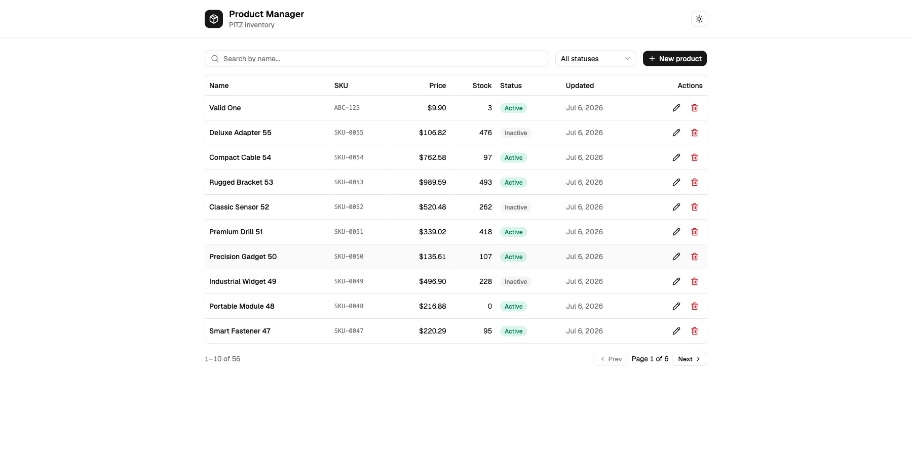

# PITZ — Product Manager

A full-stack **product management (CRUD)** application built for the PITZ technical challenge: a Ruby on Rails API and a React + TypeScript frontend, with search, filtering, pagination, validation on both ends, and a full test suite.

> **Live demo:** _added after the first Render deploy_ · frontend `https://pitz-products-web.onrender.com` · API `https://pitz-products-api.onrender.com/api/v1/products`



---

## Tech stack

| Layer | Choice | Why |
|-------|--------|-----|
| API | **Ruby on Rails 7.1** (API-only) | Requested; convention-over-configuration keeps the surface small and idiomatic. |
| DB | **PostgreSQL** | Requested; used real features — a functional `LOWER(sku)` unique index, a `pg_trgm` GIN index for search, and check constraints. |
| Pagination | **Kaminari** | Stable, well-known API (`.page.per`, `total_count`) — see [Technical decisions](#technical-decisions). |
| Serialization | **Blueprinter** | Keeps controllers thin and the JSON contract in one place. |
| Tests | **RSpec** + FactoryBot + shoulda-matchers + Faker | Requested; model + request specs. |
| CORS | **rack-cors** | Env-driven allowlist, fails closed in production. |
| Frontend | **React 19 + TypeScript (strict)** | Requested; `strict` + a linter rule ban `any`. |
| Build | **Vite** | Fast dev server and a tiny production build. |
| Styling | **Tailwind CSS v4 + shadcn/ui** | Utility-first + accessible Radix primitives, with light/dark theming. |
| Server state | **TanStack Query (React Query)** | Caching, request dedup, and cache invalidation on mutations — no hand-rolled loading/error state. |
| Forms | **react-hook-form + zod** | One zod schema is the single source of truth, mirroring the backend validations. |
| Toasts | **sonner** | Accessible, zero-config feedback. |
| Frontend tests | **Vitest + Testing Library + MSW** | Exercises the real query/mutation/axios path against a mocked API. |

## Project structure

```
pitz-products/
├── backend/          # Rails 7.1 API-only + PostgreSQL
│   ├── app/          # models, controllers (api/v1), blueprints
│   ├── config/       # env-driven database.yml, CORS, routes
│   ├── db/           # migration, schema, idempotent seeds
│   └── spec/         # RSpec model + request specs
├── frontend/         # Vite + React + TypeScript
│   └── src/          # api/, hooks/, lib/ (schema, api-client), features/products, components/ui
├── .vscode/          # full-stack debug config (rdbg + Chrome)
├── render.yaml       # Render Blueprint (Postgres + API + static site)
└── docs/
```

## Prerequisites

- **Ruby 3.3.x** and Bundler
- **Node.js 20+** and npm
- **PostgreSQL 14+** running locally

## Quick start (local)

```bash
# 1) Backend  → http://localhost:3000
cd backend
bundle install
bin/rails db:create db:migrate db:seed
bin/rails server                     # or use the VS Code "Full Stack: Debug" launcher

# 2) Frontend → http://localhost:5173  (in a second terminal)
cd frontend
npm install
npm run dev
```

The frontend talks to `http://localhost:3000/api/v1` by default. Copy `.env.example` → `.env` in each app to override anything.

## Environment variables

**Backend** (`backend/.env.example`) — for local Homebrew Postgres the defaults work with everything blank (socket connection).

| Variable | Description | Default |
|----------|-------------|---------|
| `DATABASE_URL` | Full connection URL (takes precedence; used by Render) | — |
| `POSTGRES_HOST` / `POSTGRES_PORT` / `POSTGRES_USER` / `POSTGRES_PASSWORD` | Discrete DB parts | blank / 5432 |
| `POSTGRES_DB` / `POSTGRES_DB_TEST` | Database names | `pitz_products_development` / `_test` |
| `FRONTEND_ORIGIN` | Comma-separated CORS allowlist | `http://localhost:5173` |
| `RAILS_MASTER_KEY` | Required in production (unlocks credentials) | from `config/master.key` |

**Frontend** (`frontend/.env.example`)

| Variable | Description | Default |
|----------|-------------|---------|
| `VITE_API_URL` | Backend API base URL (must be `VITE_`-prefixed) | `http://localhost:3000/api/v1` |

## Running the tests

```bash
cd backend  && bundle exec rspec        # model + request specs
cd frontend && npm test                 # Vitest + RTL + MSW
cd frontend && npm run test:coverage    # with coverage
```

## API reference

Base path: `/api/v1`. Envelope: successful reads/writes return `{ "data": ... }`; the list adds `{ "meta": ... }`; errors return `{ "error": { status, code, message, details } }`.

| Method | Path | Description |
|--------|------|-------------|
| GET | `/products` | List (paginated). Query: `page`, `per_page` (default 10, max 100), `search` (by name), `active` (`true`/`false`) |
| GET | `/products/:id` | Fetch one |
| POST | `/products` | Create |
| PUT / PATCH | `/products/:id` | Update |
| DELETE | `/products/:id` | Delete |

<details>
<summary>Sample list response</summary>

```json
{
  "data": [
    { "id": 1, "name": "Premium Widget", "description": "…", "price": "19.99",
      "stock": 42, "sku": "SKU-0001", "active": true,
      "created_at": "2026-07-06T…Z", "updated_at": "2026-07-06T…Z" }
  ],
  "meta": { "total": 55, "page": 1, "pages": 6, "per_page": 10, "next": 2, "prev": null }
}
```
</details>

<details>
<summary>Sample validation error (422)</summary>

```json
{ "error": { "status": 422, "code": "validation_error", "message": "Validation failed",
  "details": { "sku": ["has already been taken"], "price": ["must be greater than 0"] } } }
```
</details>

**Product validations** (identical in the model and the frontend zod schema):

| Field | Rule |
|-------|------|
| `name` | required, 3–100 chars |
| `description` | optional, ≤ 1000 chars |
| `price` | required, decimal `> 0` (and `< 100,000,000` to fit the column) |
| `stock` | required, integer `≥ 0` |
| `sku` | required, **unique** (case-insensitive), regex `^(?=.*[A-Z0-9])[A-Z0-9-]+$` |
| `active` | boolean, default `true` |

## Technical decisions

- **SKU rule reconciliation.** The brief's model table said "uppercase letters and numbers" while its frontend section said "…and hyphens" — a contradiction. I allowed hyphens (real-world SKUs like `ABC-123`) and kept **one regex, byte-identical on both sides**, requiring at least one alphanumeric so a pure-punctuation SKU (`-`, `---`) is rejected. Input is normalized (`strip` + `upcase`) before validation, so lowercase input is accepted and stored uppercase.
- **Kaminari over Pagy.** Pagy is faster but changed its API across major versions (`:items` → `:limit`, metadata); Kaminari's API has been stable for years. Performance is equivalent at this scale.
- **`price` serialized as a string.** JS numbers are floats and silently lose cents. The API sends `price` as a string; the frontend formats it with `Intl.NumberFormat` and only coerces to a number inside the form.
- **Consistent error envelope.** A single `rescue_from` ladder maps every failure (404 / 422 / 500) to `{ error: { status, code, message, details } }`, so the frontend maps field errors uniformly. The 500 handler never leaks a backtrace.
- **Data integrity in depth.** App-level validations are backed by DB constraints: a functional unique index on `LOWER(sku)` (race-safe), `pg_trgm` GIN index for `ILIKE` search, and `price > 0` / `stock >= 0` check constraints.
- **A multi-agent adversarial review** of the generated backend caught and fixed 7 real issues before tests were written (garbage filter values silently filtering to active-only, a deep-offset pagination DoS, a 500 on oversized prices, CORS failing open, unstable ordering) — see the git history.

## Bonus features implemented

- ✅ **React Query** for server state · ✅ **Frontend tests** (37, Vitest + RTL + MSW) · ✅ **Env-driven config**
- ✅ **Render deploy** (`render.yaml` Blueprint: Postgres + API + static site)
- ✅ **VS Code full-stack debugger** (`.vscode/` — Rails `rdbg` + Chrome, one launcher)

## Deploy (Render)

`render.yaml` is a Blueprint that provisions everything. In Render: **New + → Blueprint → connect this repo**, then set the `RAILS_MASTER_KEY` secret on the API service (the contents of `backend/config/master.key`). If Render appends a suffix to a service name, update `FRONTEND_ORIGIN` / `VITE_API_URL` so the two URLs match.

## Future improvements

- Soft deletes (`discard`) + change auditing (`audited`) — the model was designed with these in mind.
- Swagger/OpenAPI docs (`rswag`) reusing the request specs.
- CI (GitHub Actions) running both suites; Dockerized local stack (`docker-compose`).
- Code-split the frontend bundle; URL-sync the list filters (page/search) for shareable links.

## FAQ

- **Extra libraries?** Yes — each is justified in the [tech stack](#tech-stack) table.
- **Deployed?** Yes, on Render (see above).
- **What if you didn't finish everything?** The core CRUD + validations + tests are complete; remaining items are listed under [Future improvements](#future-improvements).
- **CSS framework?** TailwindCSS + shadcn/ui.
- **Authentication?** Out of scope per the brief; the focus is the CRUD.
- **Rails generators?** Used for scaffolding, then customized (thin controllers, Blueprinter, custom error handling, scopes).
